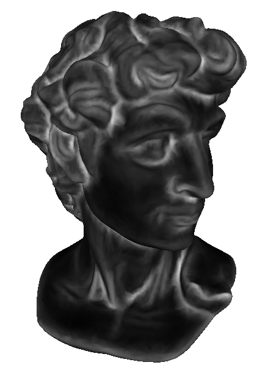
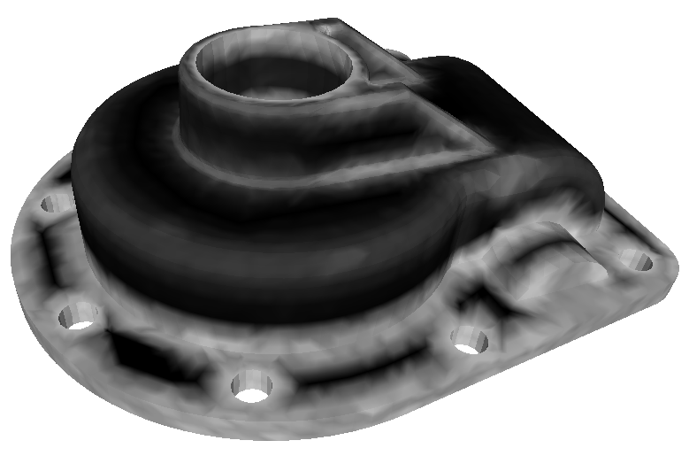

# 3D saliency based on sparse modelling and curvature flow


## Description
This repository contains an implementation of "Robust and fast 3-D saliency mapping" proposed by Gerasimos Arvanitis, Aris Lalos and konstantinos Moustakas.
The presented method was implemented in python by [Stavros Nousias](https://github.com/snousias) 

## Citation
```
Arvanitis, G., Lalos, A.S. and Moustakas, K., 2020. 
Robust and fast 3-D saliency mapping for industrial modeling applications. 
IEEE Transactions on Industrial Informatics, 17(2), pp.1307-1317.
```

```
@article{arvanitis2020robust,
  title={Robust and fast 3-D saliency mapping for industrial modeling applications},
  author={Arvanitis, Gerasimos and Lalos, Aris S and Moustakas, Konstantinos},
  journal={IEEE Transactions on Industrial Informatics},
  volume={17},
  number={2},
  pages={1307--1317},
  year={2020},
  publisher={IEEE}
}
```
## Requirements

- Python 3.8
- collections
- numpy
- sklearn
- scipy
- time
- joblib
- random

## Running the code

```
python saliencyGenerateRPCAGroundTruth.py
```

## Configuration

```
rootdir = './'
modelsDir = 'data/'
modelFilename = 'joint.obj'
```

## Results

<p align="center"></p>
     <p align="center">Head model saliency map</p>

<p align="center"></p>
     <p align="center">Casting model saliency map</p>


